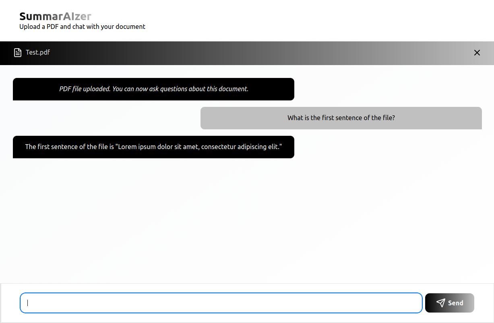

  <h2> SummarAIzer: PDF Summary Chat Bot </h2>

        

## ✨ Description:

**SummarAIzer** is an AI-Powered PDF Knowledge Assistant that answers questions you have about uploaded PDF files. Built using **LangChain.js, React, Express.js, and SupaBase** to allow users to upload PDF files, which are then turned into SupaBase Vector Stores with LangChain.js, that can then be used for user question lookup.

## ⚙️ Features:

1. **User PDF Upload:** Users can upload any PDF document they desire.
2. **AI Powered Chat:** Utilizing ChatGPT as its LLM backend, SummarAIzer allows users to chat with a bot to have questions about their PDF answered.
3. **Chat Bot Memory:** Chat bots have the ability to remember previous questions or information from their conversation with a user. Allows for more complex questions to be asked.